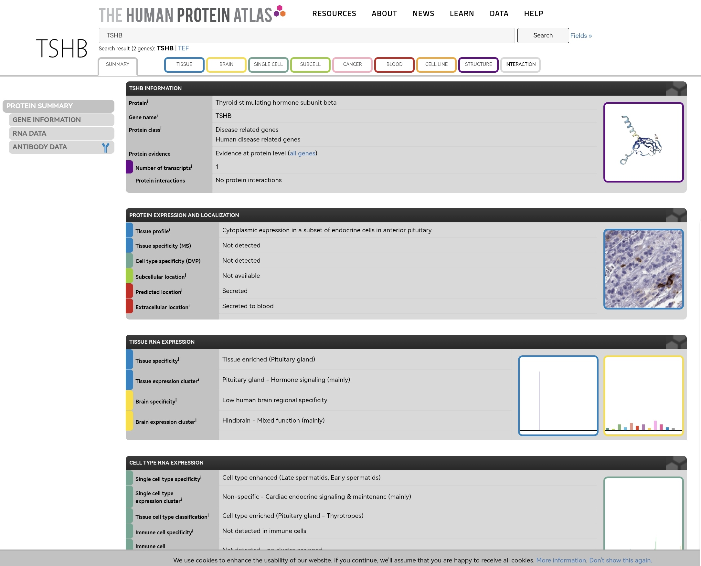
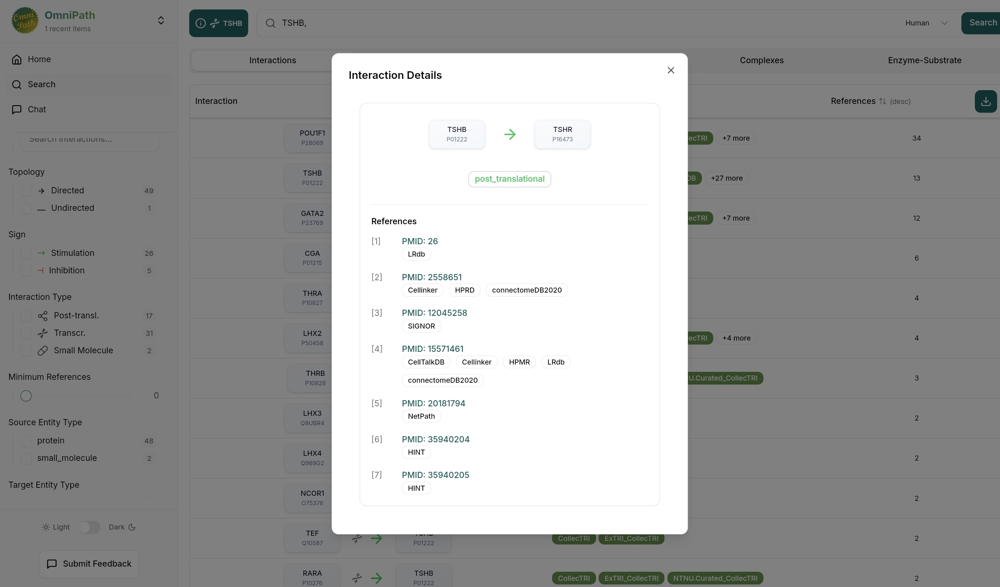
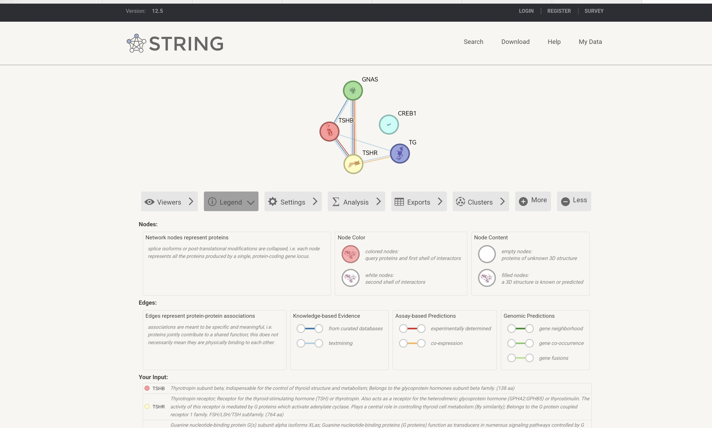
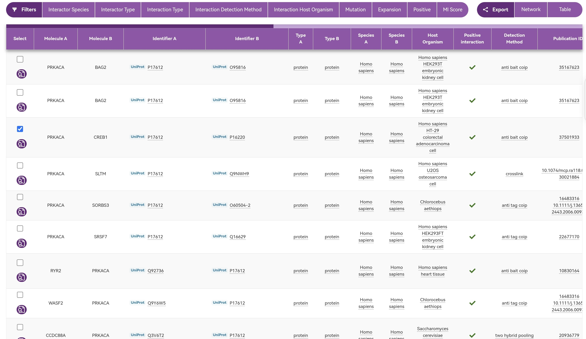
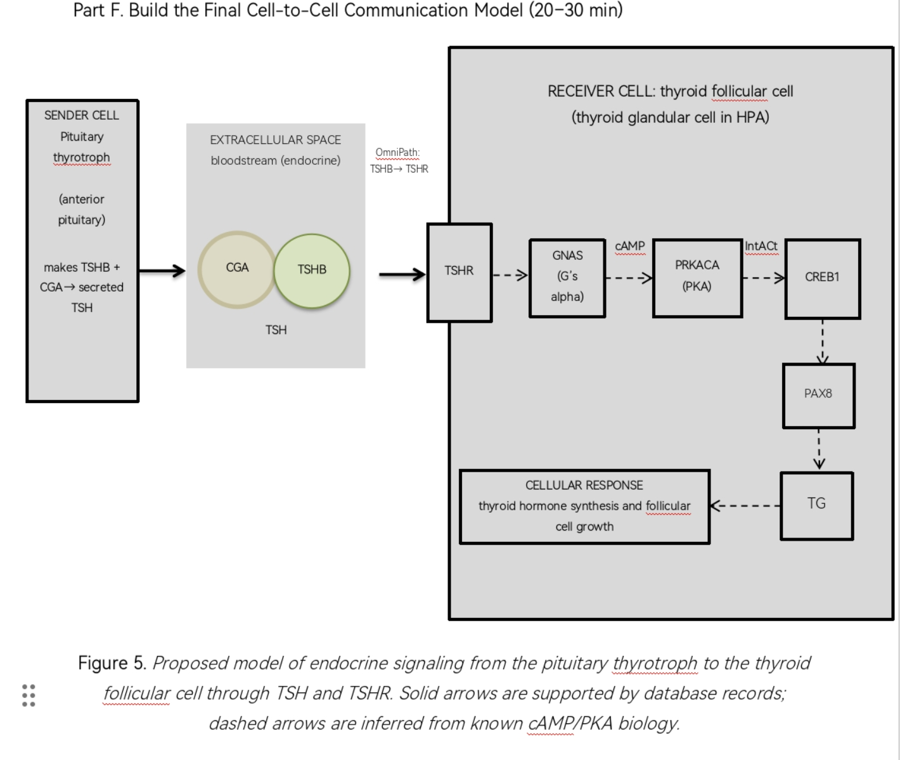

# Cell-to-Cell Communication: Pituitary Thyrotroph to Thyroid Follicular Cell (TSH-TSHR)

**Name:** Jade Angela B. Suan

**Course:** Cell and Molecular Biolgy

**Laboratory:** Individual Cell-to-Cell Communication Laboratory

## 1. Title and Biological Question

**Title:** TSH signaling from the pituitary thyrotroph to the thyroid follicular cell

**Biological question:** Can public databases (Human Protein Atlas, OmniPath, STRING, IntAct and UniProt) support a signaling route from a pituitary thyrotroph, through TSH and its receptor TSHR, to a response in the thyroid follicular cell?

## 2. Chosen Sender Cell and Biological Context

- **Sender cell:** Pituitary thyrotroph
- **Tissue/context:** Anterior pituitary gland, part of the hypothalamic-pituitary-thyroid axis.
- **Why it is a meaningful sender:** Thyrotrophs are the pituitary cells that control the thyroid gland. They release their signal into the blood, and it reaches the thyroid, which affects thyroid hormone production and metabolism.
- **Signaling type:** Endocrine

## 3. Candidate Ligand and Sender-Cell Evidence

- **Ligand:** TSH (thyroid-stimulating hormone), made of the CGA (alpha) and TSHB (beta) subunits.
- **Evidence (Human Protein Atlas, TSHB):**
  - Cytoplasmic expression in a subset of endocrine cells in the anterior pituitary.
  - RNA is tissue enriched in the pituitary gland and cell type enriched in pituitary thyrotropes.
  - Predicted to be secreted, with extracellular location "secreted to blood".
  - Caveat: HPA also lists TSHB RNA in spermatids, but I consider the pituitary protein staining stronger evidence for the sender cell.



## 4. Receptor and Receiver Cell with Supporting Evidence

- **Receptor:** TSHR (thyrotropin receptor, UniProt P16473), a G protein-coupled receptor.
- **Receiver cell:** Thyroid follicular cell (thyroid glandular cell in HPA).
- **Evidence:** HPA shows TSHR RNA as tissue enriched in the thyroid gland and cell type enriched in thyroid glandular cells. UniProt describes TSHR as a G protein-coupled receptor for thyrotropin.
- **Caveat:** HPA cell type specificity also lists other cell types for TSHR, so TSHR is not thyroid-only.

## 5. OmniPath Findings

OmniPath links **TSHB (P01222) to TSHR (P16473)** as a directed ligand-receptor interaction (type post_translational). Supporting resources include LRdb, Cellinker, HPRD, connectomeDB2020, CellTalkDB and HPMR, plus SIGNOR, NetPath and HINT.


## 6. STRING Network Interpretation

- **Database:** STRING v12.5, *Homo sapiens*
- **Input proteins (9):** TSHR, TSHB, CGA, GNAS, PRKACA, CREB1, PAX8, TG, TPO
- **Network statistics:** 9 nodes, 18 edges, 2 expected edges, PPI enrichment p = 9.65e-12
- **Enriched terms:**
  - GO:0006590 Thyroid hormone generation
  - hsa04918 Thyroid hormone synthesis (KEGG)
  - hsa04024 cAMP signaling pathway (KEGG)
  - HSA-418555 G alpha (s) signalling events (Reactome)
  - WP2032 Thyroid stimulating hormone TSH signaling (WikiPathways)
- **Proteins linking receptor activation to the response:** GNAS (Gs alpha, couples TSHR to cAMP), PRKACA (PKA catalytic subunit), CREB1 (cAMP-responsive transcription factor), PAX8 and TG (thyroid transcription factor and thyroglobulin).
- **Interpretation:** STRING edges are functional associations, not proof of direct binding or direction. The enrichment is also partly expected because I chose thyroid-related proteins. The order TSHR, GNAS, PRKACA, CREB1 comes from known cAMP/PKA biology, not from STRING.



## 7. IntAct Validation

- **Interaction:** PRKACA (P17612) and CREB1 (P16220)
- **Record:** EBI-46451554
- **Detection method:** Anti-bait coimmunoprecipitation
- **Organism / host:** *Homo sapiens*, HT-29 colorectal adenocarcinoma cells
- **Publication:** PMID 37501933 (Fig. 4D)
- **Interaction type:** Physical association
- **MI score:** 0.4
- **Evidence type:** Physical association in human cells. The record does not show direct binding, and it does not show that PRKACA phosphorylates CREB1.
- **Additional pair:** PRKACA-PRKAR1A (EBI-16107177, PMID 24855271), used only as a supporting pair because PRKAR1A is not in my STRING network.
- **No record found** for TSHR with TSHB, CGA or GNAS. This means no record was found, not that there is no interaction.



## 8. Final Model and Interpretation



**Figure 5.** Proposed model of endocrine signaling from the pituitary thyrotroph to the thyroid follicular cell through TSH and TSHR. Solid arrows are supported by database records; dashed arrows are inferred from known cAMP/PKA biology.

### Interpretation

I chose the pituitary thyrotroph as the sender cell. In the Human Protein Atlas, TSHB is enriched in the pituitary gland and in pituitary thyrotropes, and it is predicted to be secreted to the blood, so TSH (CGA + TSHB) acts as an endocrine signal. OmniPath links TSHB to TSHR (P01222 to P16473) and lists ligand-receptor resources such as CellTalkDB, Cellinker, LRdb and connectomeDB2020. HPA shows TSHR enriched in thyroid glandular cells, which supports the thyroid follicular cell as the receiver. In STRING, TSHR, TSHB, CGA, GNAS, PRKACA, CREB1, PAX8, TG and TPO formed a network with 18 edges instead of the 2 expected (p = 9.65e-12), enriched for thyroid hormone generation, cAMP signaling and TSH signaling. IntAct has a physical association record for PRKACA and CREB1 (EBI-46451554, anti-bait coimmunoprecipitation in human cells, MI score 0.4). The TSH to TSHR step and the thyroid-related network are the best supported parts. The order TSHR, GNAS, PRKACA, CREB1, PAX8 and TG is my inference from known cAMP/PKA biology, because STRING edges show association only and IntAct did not show direction or phosphorylation. The expected response is more thyroid hormone synthesis and follicular cell growth.

### Strongly supported vs. inferred

- **Strongly supported:** TSHB expression in the thyrotroph, TSHR expression in the thyroid, the OmniPath TSHB to TSHR record, and the PRKACA-CREB1 physical association in IntAct.
- **Inferred:** TSHR to GNAS to cAMP to PRKACA, and CREB1 to PAX8 to TG (dashed arrows in Figure 5).

## 9. References and Database Links

- Human Protein Atlas, TSHB (sender / ligand): https://www.proteinatlas.org/ENSG00000134200-TSHB
- Human Protein Atlas, TSHR (receptor / receiver cell): https://www.proteinatlas.org/ENSG00000165409-TSHR
- Human Protein Atlas, TG (cellular response): https://www.proteinatlas.org/ENSG00000042832-TG
- OmniPath: https://explore.omnipathdb.org/search?q=TSHB,+&tab=interactions&species=9606
- STRING network: https://string-db.org/cgi/network?taskId=bH1QFIg0Th6v&sessionId=bIBeScWpzN5T
- IntAct (EBI-46451554): https://www.ebi.ac.uk/intact/search?query=EBI-46451554
- UniProt: https://www.uniprot.org/
- Database home pages: [OmniPath](https://omnipathdb.org/), [STRING](https://string-db.org/), [IntAct](https://www.ebi.ac.uk/intact/), [Human Protein Atlas](https://www.proteinatlas.org/), [UniProt](https://www.uniprot.org/)

## Repository Contents

```
cell-cell-communication/
  README.md
  figures/
    01_sender_cell_evidence.png
    02_omnipath_interaction.png
    03_string_network.png
    04_intact_validation.png
    05_final_model.png
  data/
    interaction_summary.csv
```1
